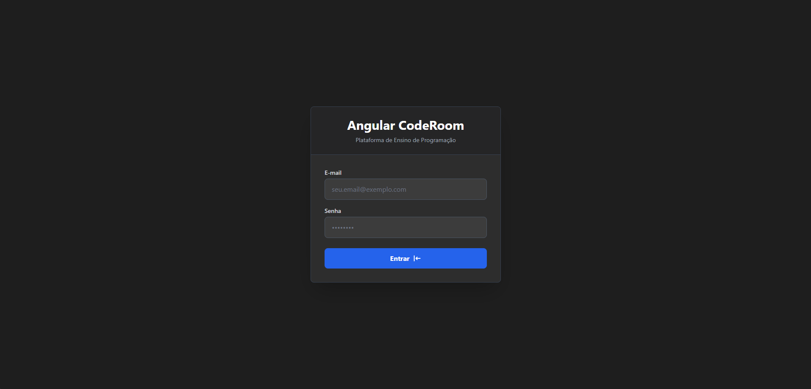
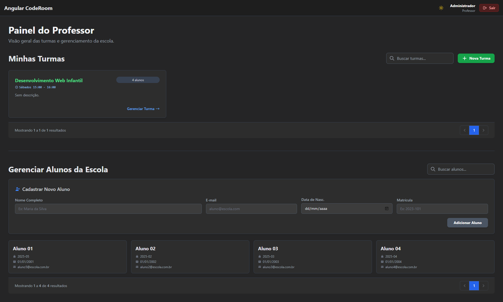
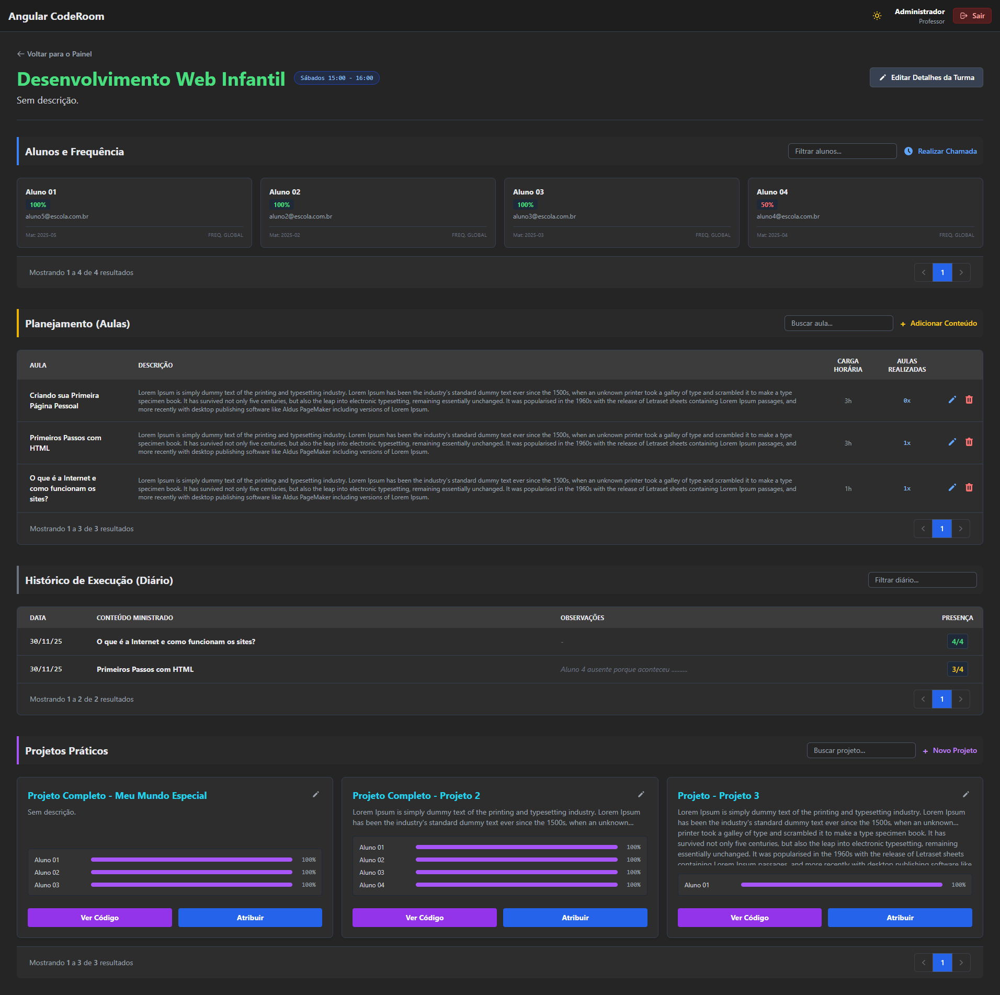
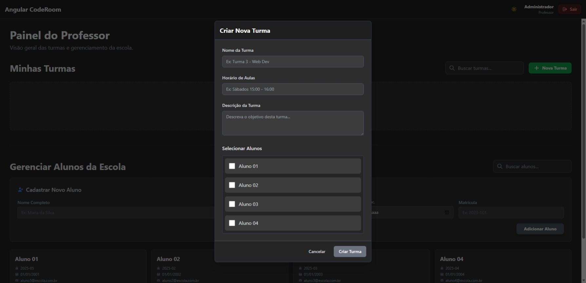

# Angular CodeRoom

> Full-stack classroom application for coding lessons — Angular frontend + NestJS backend.

## Project Overview

Angular CodeRoom is a learning-oriented full-stack application that provides a classroom experience for coding lessons and small projects. It includes:

- A frontend built with Angular (standalone components, signals-based state management, TailwindCSS).
- A backend built with NestJS and Sequelize (MySQL) providing authentication, project management, attendance, and other classroom features.

## Repository Layout

- `frontend/` — Angular application (entry: `index.tsx`). Uses modern Angular 20 patterns: standalone components and signals.
- `backend/` — NestJS API with Sequelize ORM, migrations and seeders under `backend/sequelize`.
- `screenshots/` — Example images and UI screenshots (added by repository owner).
- `docker-compose.yml` — Docker Compose configuration for the database used in development.

## Key Features

- Role-based dashboards (student/teacher).
- Live code editor and preview (managed via `CodeService`).
- JWT authentication and mock login helpers for local development.
- Sequelize migrations and seeders to create initial schema and demo data.

## Prerequisites

Make sure you have these installed on your machine:

- Node.js (16+ recommended)
- `npm` (or other package manager like `pnpm`/`yarn`)
- Docker & Docker Compose (for running MySQL locally)

## Quick start — Development

1. Start the database (Docker Compose):

```bash
# from project root
docker compose up -d
```

2. Backend

```bash
cd backend
npm install
# run migrations / seeders if needed (see backend/README.md)
npm run start
```

3. Frontend

```bash
cd frontend
npm install
npm run dev
# or use: npm run start
```

Notes:
- Backend start script is `npm run start` inside `backend/`.
- Frontend dev script is `npm run dev` inside `frontend/` (see `frontend/package.json` for exact scripts).

## Migrations & Seeding

The backend uses Sequelize migrations and seeders located in `backend/sequelize`. There are helper scripts in `backend/scripts/` to run and validate migrations. See `backend/BACKEND_INSTRUCTIONS.md` for more details.

## Screenshots

The repository includes a `screenshots/` directory with images demonstrating the UI and flows. Use these for documentation, PR descriptions, or to build the project README screenshots section. To reference an image in Markdown:

```markdown

```

## Contributing

If you want to contribute:

- Open issues describing bugs or feature requests.
- Fork the repo and create feature branches for PRs.
- Follow existing code patterns: signals for state, standalone components, and Tailwind for styling.

## Useful Links & Notes

- Frontend entry: `frontend/index.tsx`.
- Backend entry: `backend/src/main.ts`.
- Mock auth credentials used for development are described in `backend` and in `AuthService` mocks (see `frontend` services for matching mocks).

## License

This project is licensed under the terms in the repository `LICENSE` file.

---

If you want, I can also add a short visual README section that embeds a few of the images from `screenshots/`. Want me to add that now?

## Visual Preview

Here are a few screenshots from the `screenshots/` folder showing the app UI (login, teacher dashboard, class views):








